# SPSS in education

## 1) Кронбах альфа коэффициенті (Cronbach's Alpha)
### `бұл сауалнаманың немесе тесттің ішкі сенімділігін (internal consistency) тексеру үшін қолданылатын статистикалық көрсеткіш. Ол сауалнамадағы сұрақтардың бір-бірімен қаншалықты тығыз байланысты екенін және олардың ортақ бір құбылысты өлшейтінін бағалайды.`

### 
| Кронбах альфа (α) мәні | Сенімділік деңгейі |
| - | - |
| α ≥ 0.9 | Өте жақсы сенімділік |
| 0.8 ≤ α < 0.9 | Жақсы сенімділік |
| 0.7 ≤ α < 0.8 | Қанағаттанарлық сенімділік |
| 0.6 ≤ α < 0.7 | Күмәнді сенімділік |
| 0.5 ≤ α < 0.6 | Төмен сенімділік |
| α < 0.5 | Қанағаттанарлықсыз сенімділік |

### SPSS-те Кронбах альфасын тексеру қадамдары
#### 1) Мәзірге өту: SPSS-тің негізгі терезесінде ==Analyze (Анализ) -> Scale (Шкала) -> Reliability Analysis... (Анализ надежности...)== жолын таңдаңыз.
#### 2) Сұрақтарды таңдау: Ашылған терезеде сенімділігін тексергіңіз келетін барлық сұрақтарды (өзгермелілерді) сол жақтағы тізімнен оң жақтағы Items (Элементы) терезесіне көшіріңіз.
#### 3) Статистиканы таңдау (міндетті емес, бірақ ұсынылады): ==Statistics... (Статистика...)== батырмасын басыңыз. Ашылған терезеде ==Descriptives for (Описательные статистики для) бөлімінде Item (Элемент), Scale (Шкала) және Scale if item deleted (Шкала, если элемент удален)== опцияларын таңдаңыз. Бұл қосымша талдау үшін маңызды. ==Continue (Продолжить)== батырмасын басыңыз. Талдауды іске қосу: ==OK== батырмасын басу арқылы талдауды бастаңыз.
#### Фото нұсқаулық 
- 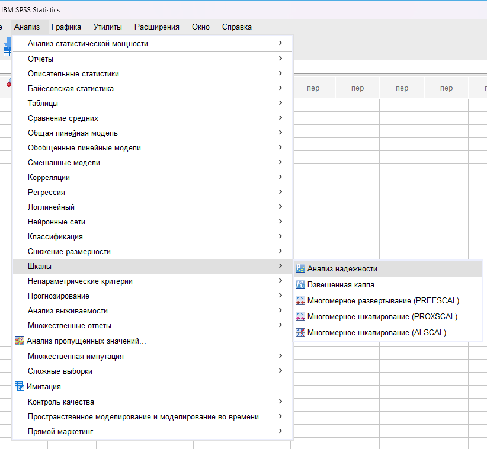 
  - 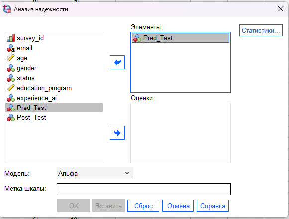
    - 
      - 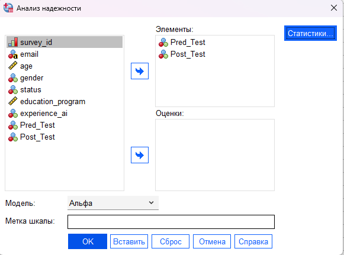
        - 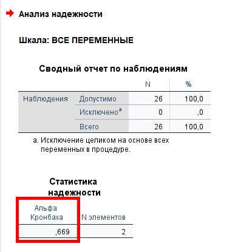

## 2) Нормальдылыққа тексерілуі (проверка на нормальность)

- `бұл таңдалған деректердің қалыпты (нормалды) таралу заңдылығына сәйкес келетінін немесе келмейтінін анықтайтын маңызды қадам. Бұл тексеріс қай статистикалық критерийді қолдану керектігін анықтау үшін қажет.Нормальдылықты тексеру критерийлері Дұрыс критерийді таңдау зерттеудегі респонденттердің (немесе деректердің) жалпы санына байланысты:`
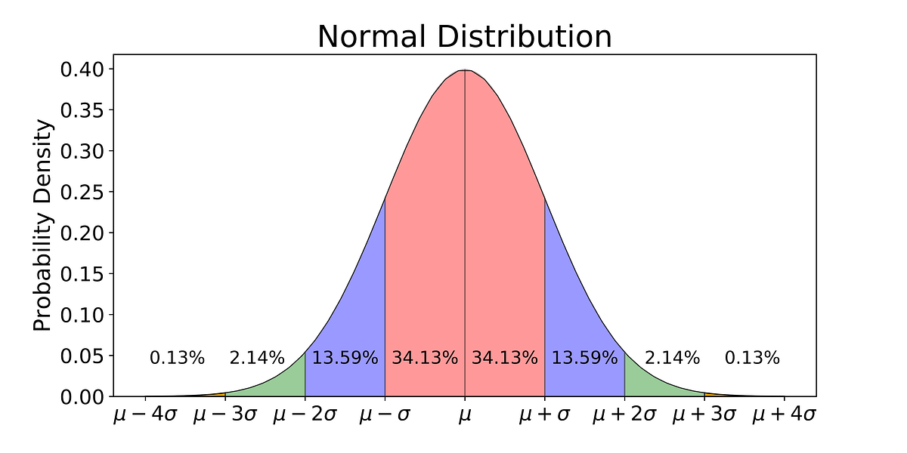
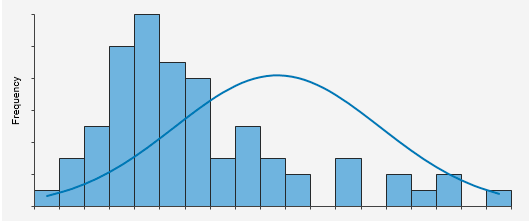
    - Егер респонденттер саны ==50-ден жоғары== болса, Колмогоров-Смирнов критерийі қолданылады.
    - Егер респонденттер саны ==50-ден төмен== болса, Шапиро-Уилка критерийі қолданылады.
- Нәтижелерді талдау `Тексеру нәтижесінде алынған статистикалық маңыздылық деңгейі (p-мәні немесе "знач.") деректердің таралуы туралы шешім қабылдауға мүмкіндік береді:`
  - ==p > 0.05 (0.05-тен жоғары):== Бұл деректердің ==таралуы қалыпты (нормалды)== екенін білдіреді. Таралудағы ауытқу аз деп саналады. Бұл жағдайда талдау үшін параметрлік тесттер қолданылады (мысалы, Т-критерий, ANOVA).
  - ==p < 0.05 (0.05-тен төмен):== Бұл деректердің таралуы ==қалыпты емес== екенін көрсетеді. Таралудағы ауытқу көп деп есептеледі. Мұндай жағдайда параметрлік емес тесттер қолданылады (мысалы, Манн-Уитни U-критерийі, Вилкоксон критерийі).

- Фото нұсқаулық 
  - 
    - 
      - 
        - 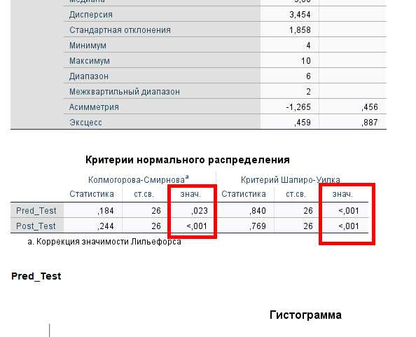

## Статистикалық критерий таңдау нұсқаулығы

  - Мен тәуелді айнымалылар арасындағы қатынасты зерттеймін
    - Сіз қанша тәуелді айнымалымен жұмыс істейсіз?
        - Екі тәуелді айнымалы
          - Параметрлік
            - Корреляция коэффициентінің маңыздылығының $t$-критерийі ($t$-критерий значимости коэффициента корреляции)  
            `Негізгі және балама гипотезаларды тұжырымдау.` 
            ==Негізгі (Нөлдік) гипотеза ($H_0$):== Неке сапасы мен ата-аналар мен балалар арасындағы қарым-қатынас сапасы арасында байланыстың жоқтығын **($\rho>0.05$)** растайды.
            ==Балама гипотеза ($H_1$):== Бұл екі жақты және бағытталмаған гипотеза, себебі ол екі айнымалы арасындағы өзара байланыстың бар екенін растайды **($\rho <0.05$)**, бірақ бұл байланыстың бағытын (оң немесе теріс) көрсетпейді.
              - [Date Set ссылкасы](Data_Sets/Chapter%2015%20Data%20Set%201.sav)
              - ==Анализ (Analyze) ⇒ Корреляции (Correlate) ⇒ Парные (Bivariate)==
              - Фото нұсқаулық
                - 1-қадам 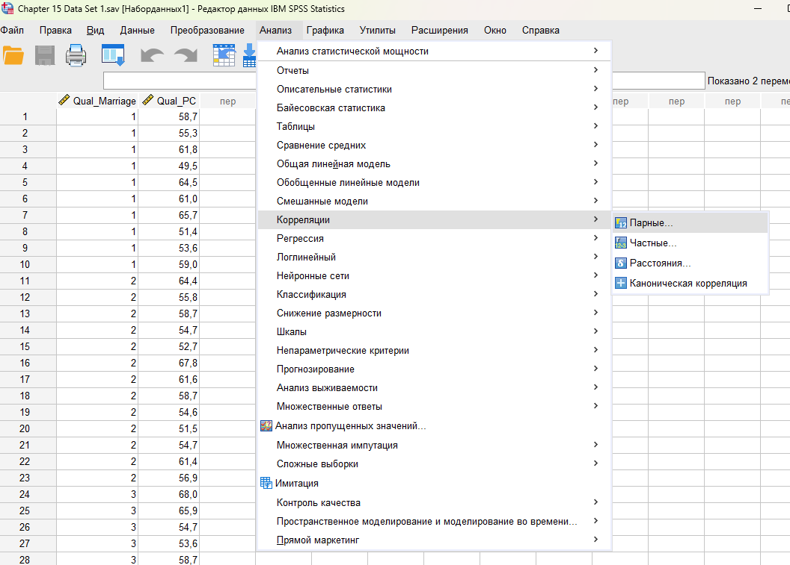
                  - 2-қадам 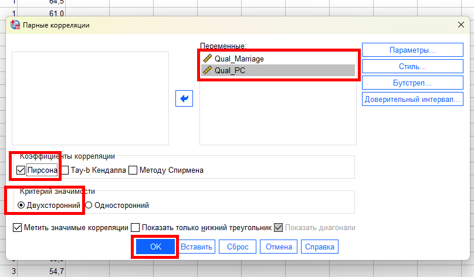
                    - 3-қадам  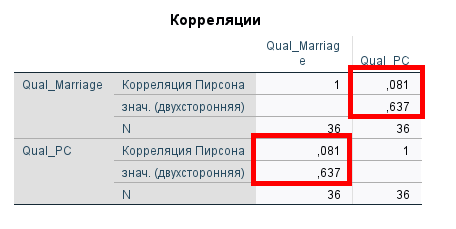  
                    ==Нәтиже== 
                    $r=0,081$ корреляция коэффициенті екі айнымалы арасындағы өте әлсіз, тіпті жоққа тән сызықтық байланысты көрсетеді, ал $p=0,637$ маңыздылық деңгейі (әдеттегі $0,05$ шегінен көп) бұл байланыстың **статистикалық тұрғыдан маңызды емес** екенін білдіреді, яғни ==негізгі гипотеза== қабылданады.
          - Параметрлік ==емес==
            - Спирмен корреляция коэффициенті ($r_s$),
             `Негізгі және баламалы гипотезаларды тұжырымдау`  
             ==Негізгі (Нөлдік) гипотеза ($H_0$)==:Қызметкердің жұмыс тәжірибесі мен оның жұмысқа қанағаттануы арасында монотонды байланыс жоқ екенін растайды ($p \ge 0.05$). (Монотонды байланыс дегеніміз, бір айнымалы өскенде, екіншісі үнемі өседі немесе үнемі кемиді деген сөз).
             ==Балама гипотеза ($H_1$)==:Екі айнымалы арасында монотонды байланыс бар екенін растайды ($p < 0.05$). Бұл екі жақты гипотеза, себебі ол байланыстың бағытын (оң немесе теріс) көрсетпейді.
              - [Date Set ссылкасы](Data_Sets/Chapter%2015%20Data%20Set%201.sav)
              - ==Анализ (Analyze) ⇒ Корреляции (Correlate) ⇒ Парные (Bivariate)==
              - Фото нұсқаулық
                - 1-қадам 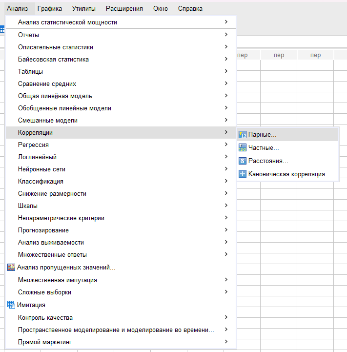
                  - 2-қадам 
                    - 3-қадам 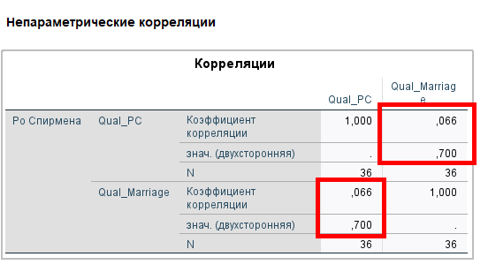
                    Корреляция коэффициенті $\mathbf{r_s = 0.066}$ — бұл өте әлсіз, тіпті жоққа тән байланысты көрсетеді.Маңыздылық деңгейі $\mathbf{p = 0.700}$ — бұл мән $\mathbf{0.05}$ шегінен әлдеқайда үлкен.Қорытынды (Қазақша):$p$-мәні $\mathbf{0.700}$-ге тең болғандықтан ($\mathbf{p \ge 0.05}$), ==негізгі (нөлдік) гипотеза ($H_0$)== қабылданады.

            - Кендалл Тау ($\tau$)  
            ==Негізгі (Нөлдік) гипотеза ($\mathbf{H_0}$)== Неке сапасы мен ата-аналар мен балалар арасындағы қарым-қатынас сапасы арасында монотонды байланыстың жоқтығын растайды ($p \ge 0.05$).
            (Түсініктеме: Бұл екі айнымалы рангтерінің арасында ешқандай жүйелі байланыс жоқ дегенді білдіреді.)  
            ==Балама гипотеза ($\mathbf{H_1}$)== Екі айнымалы арасында монотонды байланыс бар екенін растайды ($p < 0.05$).
            (Түсініктеме: Бұл екі жақты гипотеза, себебі ол байланыстың оң немесе теріс бағытын көрсетпейді, тек оның бар екенін көрсетеді.)
              - [Date Set ссылкасы](Data_Sets/Chapter%2015%20Data%20Set%201.sav)
              - ==Анализ (Analyze) ⇒ Корреляции (Correlate) ⇒ Парные (Bivariate)==
              -  Фотонұсқаулық
                - 1-қадам 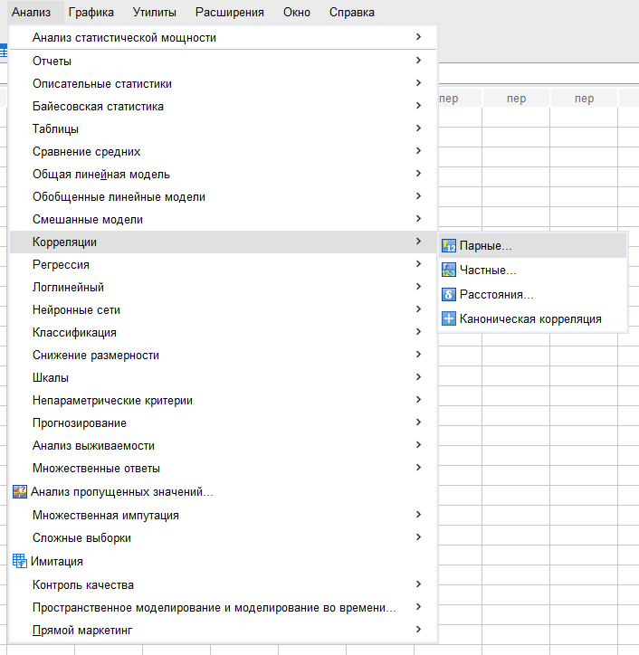
                  - 2-қадам 
                    - 3-қадам 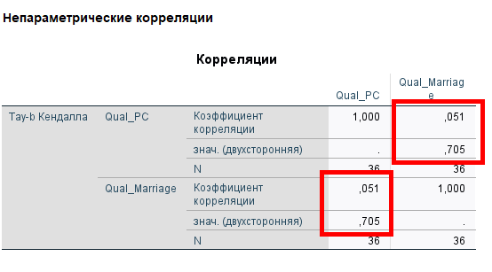
                    Байланыстың күші мен бағыты: $\mathbf{\tau = 0.051}$ мәні өте әлсіз (нөлге жақын) және оң (тікелей) монотонды байланысты көрсетеді. 
                    Статистикалық маңыздылық: Маңыздылық деңгейі $\mathbf{p = 0.705}$ құрады. Бұл мән $\mathbf{0.05}$ шегінен әлдеқайда үлкен $(\mathbf{p \ge 0.05})$.
                    $\mathbf{p > 0.05}$ болғандықтан, ==негізгі (нөлдік) гипотеза ($\mathbf{H_0}$)== қабылданады.
      - Екіден көп тәуелді айнымалы
        - Регрессия, факторлық анализ немесе каноникалық анализ
  - Мен бір немесе бірнеше тәуелді айнымалылардан тұратын топтар арасындағы айырмашылықтарды зерттеймін
    - Бір қатысушы бірнеше рет тестілеуден өтеді ма?
      - Иа
        - Сіз қанша топпен жұмыс істейсіз?
          - Екі топ
            - Параметрлік
              - Тәуелді үлгілер үшін t-критерийі (t-критерий для зависимых выборок)
              `Негізгі және балама гипотезаларды тұжырымдау`  
              ==Негізгі (Нөлдік) гипотеза ($H_0$)== бағдарламаны өткізгенге дейінгі және кейінгі бағалардың орташа мәндері арасында айырмашылық жоқ екенін растайды.  
              ==Балама гипотеза ($H_1$)== бір жақты және бағытталған болып табылады, себебі ол бағдарлама аяқталғаннан кейінгі бағаның оған дейінгі бағадан жоғары болатынын растайды.
                - [Data Set ссылкасы](Data_Sets/Chapter%2015%20Data%20Set%201.sav)
                - ==Анализ (Analyze) ⇒ Сравнение средних (Compare Means) ⇒ T критерий для парных выборок (Paired-Samples T Test)==
                - Фото нұсқаулық
                  - 1-қадам 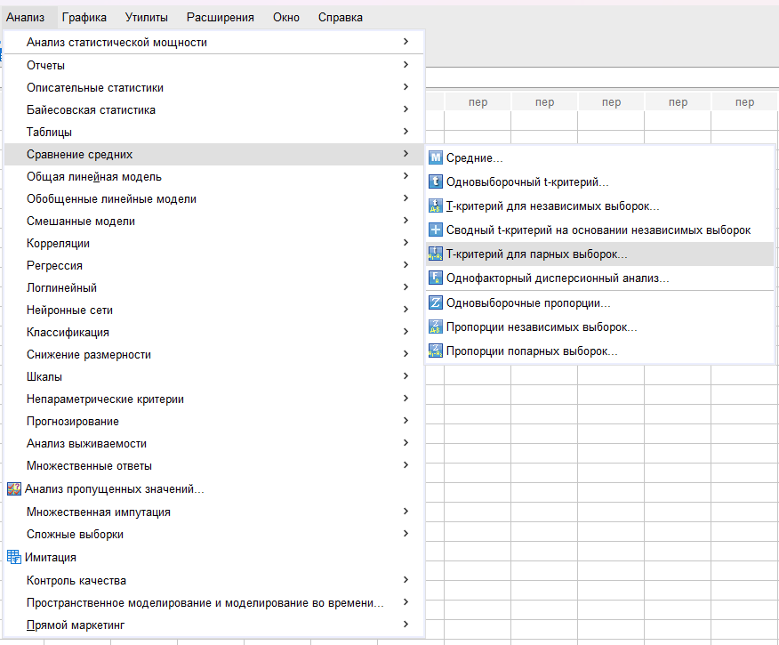
                    - 2-қадам 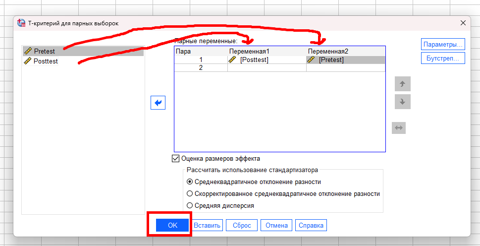
                      - 3-қадам
                      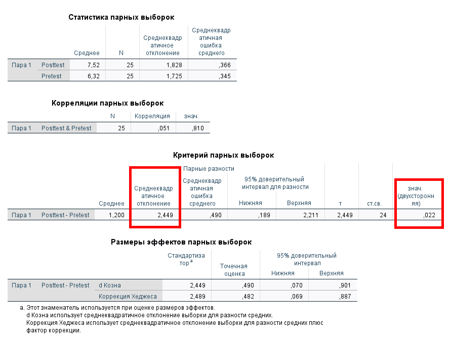
                      Жұптық үлгілер үшін $\mathbf{t}$-критерийінің мәні $\mathbf{t(24) = 2.449}$ құрады. Маңыздылық деңгейі $\mathbf{p = 0.022}$.$\mathbf{p < 0.05}$ болғандықтан, Негізгі (Нөлдік) гипотеза ($\mathbf{H_0}$) жоққа шығарылады.Бұл дегеніміз, бағдарламаға дейінгі және кейінгі орташа бағалар арасында статистикалық тұрғыдан маңызды айырмашылық бар. Қатысушылардың $\mathbf{7.52}$ балы ($\text{Posttest}$) $\mathbf{6.32}$ балынан ($\text{Pretest}$) маңызды түрде жоғарылады.
            - Параметрлік ==емес==
              - Белгілер критерийі, Уилкоксон критерийі (W-критерийі) 
              `Негізгі және балама гипотезаларды тұжырымдау`  
              ==Негізгі (Нөлдік) гипотеза ($\mathbf{H_0}$)== Бағдарламаны өткізгеннен кейінгі бағалардың медианасы мен бағдарламаға дейінгі бағалардың медианасы арасында статистикалық тұрғыдан маңызды айырмашылық жоқ екенін растайды ($p \ge 0.05$).  
              ==Балама гипотеза ($\mathbf{H_1}$)== Бағдарламаны өткізгеннен кейінгі бағалардың медианасы бағдарламаға дейінгі бағалардың медианасынан жоғары екенін растайды ($p < 0.05$).
                - [Data Set ссылкасы](Data_Sets/Chapter%2015%20Data%20Set%201.sav)
                -  ==Анализ (Analyze) $\Rightarrow$ Непараметрические критерии (Nonparametric Tests) $\Rightarrow$ Устаревшие диалоги (Legacy Dialogs) $\Rightarrow$ Для двух связанных выборки (2 Related Samples)==
                - Фото нұсқаулық 
                  - 1-қадам 
                    - 2-қадам 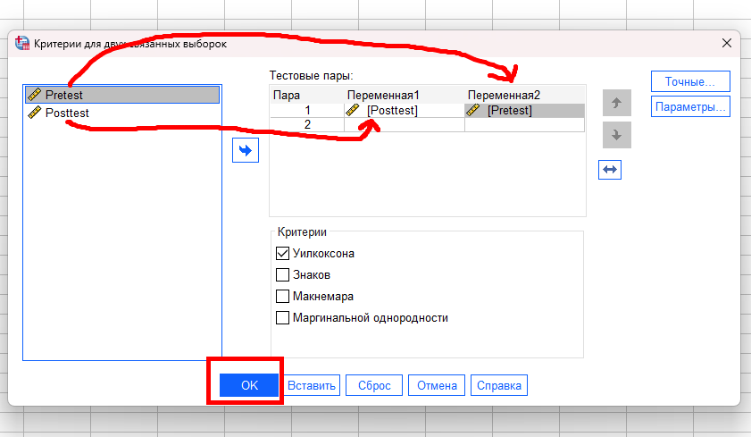
                      - 3-қадам 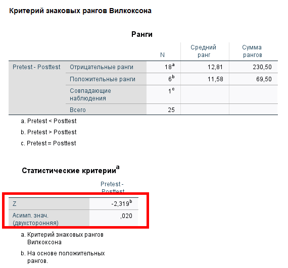 Уилкоксон критерийі бойынша $\mathbf{Z = -2.319}$ мәні алынды, ал оған сәйкес екі жақты маңыздылық деңгейі $\mathbf{p = 0.020}$ құрады.$\mathbf{p < 0.05}$ болғандықтан, ==Негізгі (Нөлдік) гипотеза ($\mathbf{H_0}$) жоққа шығарылады==.
          - Екіден көп топ
            - Параметрлік 
               - Қайталанған өлшемдердің дисперсиялық талдауы (ANOVA)
            - Параметрлік ==емес== 
              - Фридман критерийі ($\chi^2_r$ Фридмана), Кохранның Q-критерийі (номиналды деректер үшін)
      - Жоқ
        - Сіз қанша топпен жұмыс істейсіз?
          - Екі топ
            - Параметрлік 
              - Тәуелсіз үлгілер үшін t-критерийі (Стьюденттің t-критерийі)
            - Параметрлік ==емес==
              - Манн-Уитнидің U-критерийі
          - Екіден көп топ
            - Параметрлік
              - Қарапайым дисперсиялық талдау (Бір факторлы ANOVA)
            - Параметрлік емес
              - Краскал-Уоллистің H-критерийі